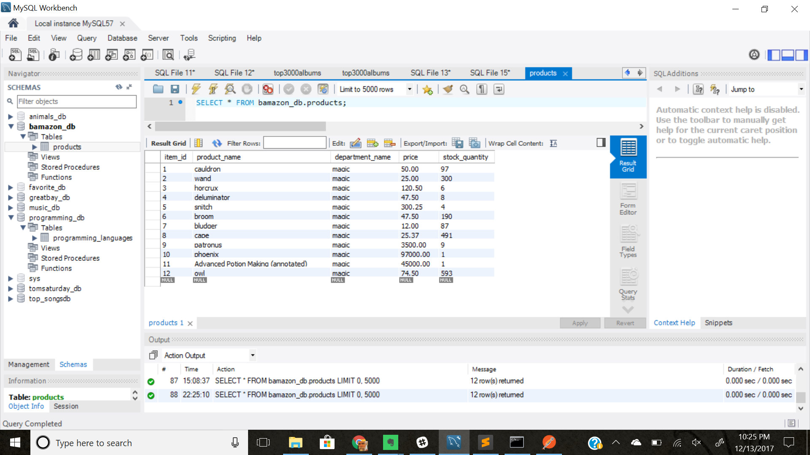
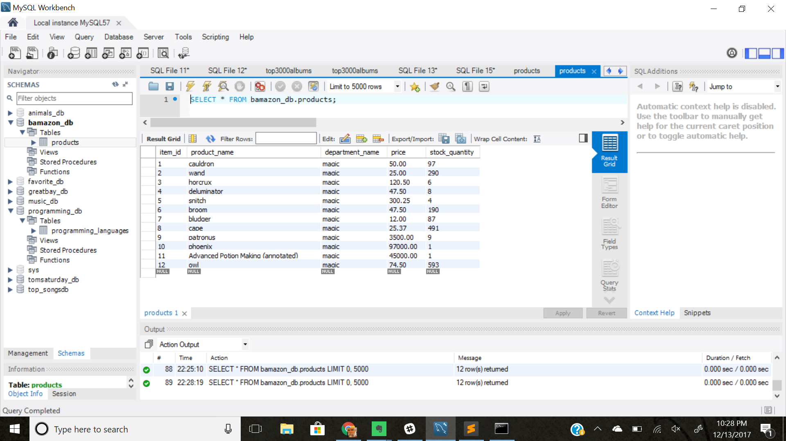

# bamazon-node-mysql

This is node based app utilizing mySQL to store a list of products one might need
for a school year at Hogwarts.

The user should type "node bamazonCustomer.js" at the terminal prompt.

The list of available items and prices appears.

This screen shows mySQL where the database bamazon_db is stored, and
the table named products.

After selecting wands to buy, the second prompt appears, and type in 10.

After entering the quantity the user wishes to purchase, the app
displays if there are enough available, and what the total price is.
Then the user is prompted if they wish to continue.
Or if there isn't enough available, then the user is also prompted if they wish
to continue.

This second shot of the mySQL database and products table shows that 10 wands 
have been removed.

If the user selects "y" to continue, then the list of products appears again
minus the the quantity of the item the user just purchased.

If the user selects "n" to stop, then they are thanked for shopping and the app stops.
![after selecting n]"(/images/select_n_to_stop.png)
